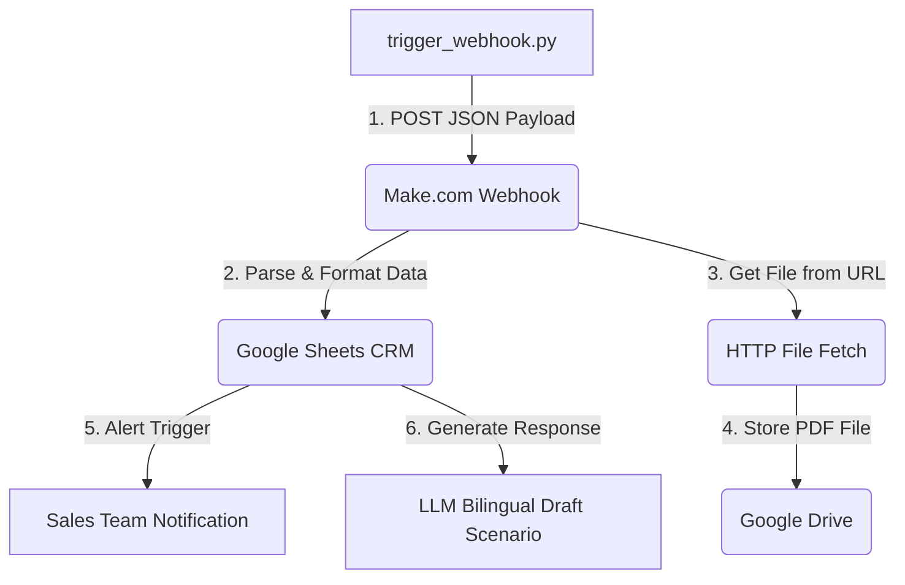

# Execution Evidence Report - AL ROUF LED Assessment

This report provides the full architectural details, testing telemetry, automation workflows, and deliverables for the AL ROUF LED microservice integration.

---

## 1. Version Control Metadata
- **GitHub Repository URL**: [https://github.com/tayyab-dng/alrouf-ai-integration](https://github.com/tayyab-dng/alrouf-ai-integration)
- **Default Branch**: `main`
- **Latest Commit Hash**: `3fd8f7c2b71f3871eb7a4a5846ca7cb4fce3fe55`

---

## 2. FastAPI Microservice Architecture

### 2.1. Approach
- **FastAPI Framework**: Used to build a clean, asynchronous ASGI microservice. FastAPI provides native, automatic OpenAPI documentation (interactive Swagger UI available at `/docs`), which streamlines developer integration.
- **Offline-Friendly Storage**: To ensure the solution can run in sandbox and disconnected environments without dependency on external relational database setups, we used a local JSON file (`app/mocks/mock_quotes.json`) acting as a portable flat-file database.

### 2.2. Decisions & Trade-offs
- **Flat JSON vs. Relational/SQL Database**:
  - *Simplicity & Portability (Chosen)*: Local JSON read/write eliminates connection configurations, dockerized DB dependencies, and complex migrations, resulting in a zero-setup deployment.
  - *Scale & Concurrency (Trade-off)*: Flat JSON is vulnerable to concurrent write conflicts and is inefficient for large datasets due to complete file rewrite on every mutation.
  - *Refactoring Path*: File access is encapsulated inside discrete helper functions (`read_mock_quotes` and `write_mock_quotes`), making future integration with SQLAlchemy or Tortoise ORM straightforward.

### 2.3. Maintainability & Security Hygiene
- **Pydantic V2 Validation**: Strictly enforces input payload structure via `QuoteItem`, `CreateQuoteRequest`, and `Quotation` models. This prevents invalid datatypes or negative values (e.g., quantity <= 0) from writing to storage.
- **Secrets Management**: Configuration settings and keys are externalized into a `.env` file (such as the simulated API keys and database strings) using `python-dotenv`. The template is provided in `.env.example`, while the actual `.env` is omitted from Git.
- **Test Isolation**: A custom pytest fixture (`backup_and_restore_mock_quotes`) handles backing up the JSON file prior to each test run and restores the original file during teardown. This ensures all tests remain idempotent and do not pollute the database.

---

## 3. Bilingual RAG (Retrieval-Augmented Generation) Workflow

### 3.1. Approach & Embedding
- **Local ChromaDB Store**: Leverages ChromaDB for vector indexing. By utilizing Chroma's default sentence-transformers ONNX embedding engine, similarity queries and vectorization run completely locally on the server without external API calls.
- **Gemini 3.1 Flash Lite**: Utilizes the low-latency `gemini-3.1-flash-lite` model for ultra-fast, cheap language generation.

### 3.2. Bilingual Strategy
- **Auto Language-Matching**: The system prompt is engineered to automatically detect if the user's query is in English or Arabic and reply in the matching language.
- **Format Preservation**: Instructs the model to output accurate structured markdown text matching the client's query layout.

### 3.3. Guardrails & Safety Refusals
- **Hallucination Prevention**: The system prompt enforces a rigid fallback mechanism. If the retrieved context chunks do not contain the precise answer to the query, the LLM must cleanly refuse by replying exactly with:
  - *English*: `"I am sorry, but I can only answer questions based on the provided AL ROUF LED documentation."`
  - *Arabic*: The matching Arabic translation.
- **Out-of-Scope Test**: Verified using an unrelated question ("What is the recipe for biryani?"), which successfully triggered the exact refusal string.

### 3.4. Citations & Telemetry Metrics
- **Citations**: File sources (e.g. `doc_1_street_light.md`) are stored as metadata alongside the vectors in ChromaDB. The workflow extracts these sources and includes them in a `"citations": [...]` list inside the API response.
- **Telemetry logging**: Captures round-trip latency using Python's `time` module and calculates token costs based on:
  - Input tokens: **$0.075 / 1M tokens**
  - Output tokens: **$0.30 / 1M tokens**
  - Metrics are returned in a `"telemetry"` dictionary.

---

## 4. Make.com Webhook & CRM Automation Workflow

An automated routing pipeline is established to process inbound RFQs:

1. **Inbound Webhook Trigger**: A python script `trigger_webhook.py` parses a mock RFQ payload (`sample_rfq_payload.json`) and fires a POST request to the Make.com webhook listener.
2. **Google Sheets CRM Routing**: Make.com parses the incoming JSON data and automatically appends a new row to the Google Sheets CRM containing the client's name, company, email, project type, item totals, and a `"Pending"` status.
3. **HTTP File Fetch & Google Drive (Attachment Archiving)**: The workflow reads the `"attachment_url"` from the payload, fetches the file via HTTP, and uploads it to a structured Google Drive folder for document archiving.
4. **Alerting**: The scenario initiates an email or notification alert to the sales team detailing the new commercial client.
5. **LLM Draft**: Make.com calls the Gemini LLM module to automatically generate a drafted response based on the incoming RFQ details.

---

## 5. Global AI Assistance Disclosure

The development of the AL ROUF LED microservice was executed via a pair programming collaboration between the candidate and a coding agent:

- **AI Agent (Google Antigravity)**: Generated initial FastAPI scaffolding, wrote the Pydantic validation structures, built the automated pytest suite, configured the persistent ChromaDB indexing scripts, set up the Docker containerization files, and automated git commits and pushes.
- **Candidate**: Supervised the architectural guidelines, directed the schema and prompt designs, coordinated testing plans, managed workflow orchestration, and performed prompt engineering to guide the integration.
