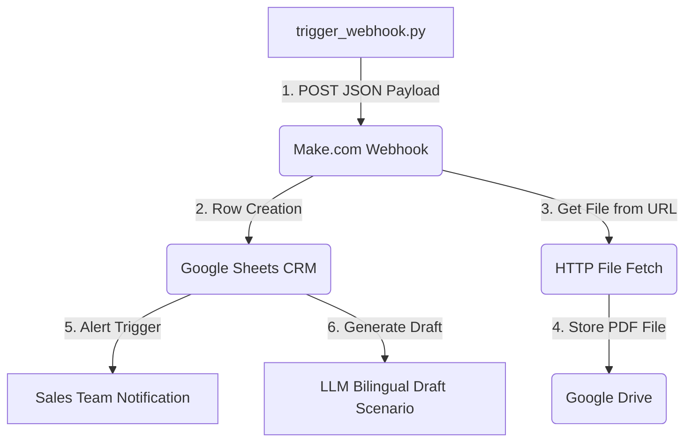

# Make.com Workflow Architecture

This document describes the automated routing and processing scenario configured in Make.com.

## Architecture Pipeline

The pipeline operates sequentially as follows:

1. **Webhook Listener**: Listens for inbound POST webhook payloads at the configured endpoint URL.
2. **Google Sheets CRM Routing**: Parses JSON values (client name, contact info, total requested items, additional notes) and appends a row representing the RFQ state to the CRM sheet.
3. **HTTP File Fetch**: Reads the incoming `"attachment_url"` from the payload and downloads the commercial RFQ PDF file.
4. **Google Drive (Attachment Archiving)**: Uploads the fetched PDF file to a designated corporate Google Drive archive directory for permanent record preservation.
5. **Sales Alerting**: Automatically triggers notification alerts (email/Slack) to the commercial sales team.
6. **LLM Response Drafting**: Processes the payload details using Gemini, generating bilingual drafts (English/Arabic) based on client request parameters.
